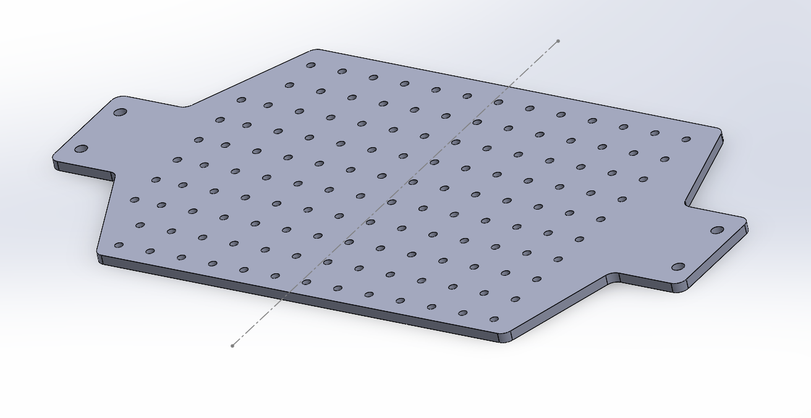
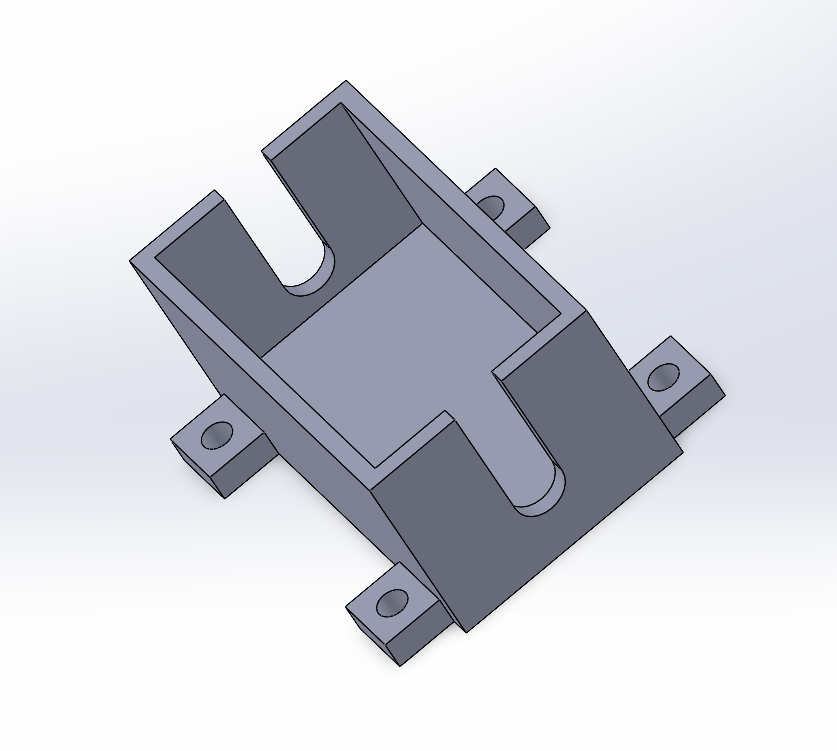
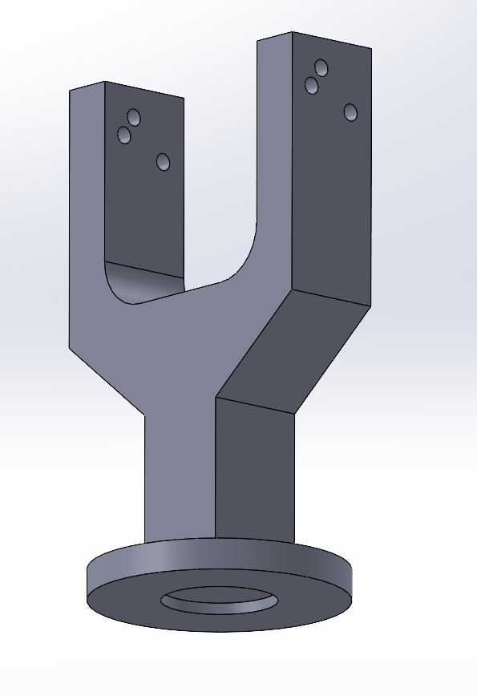
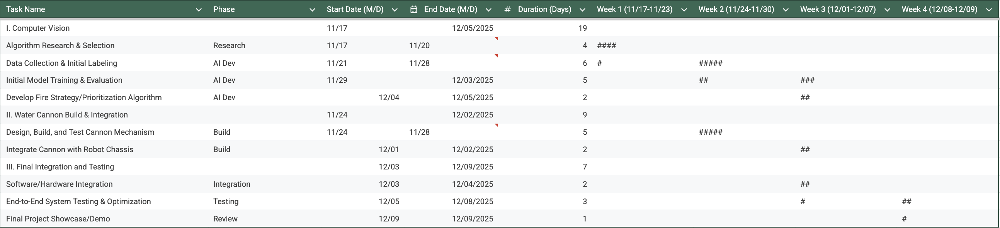

Autonomous Firefighter Robot

ROS2-Based Perception, Decision-Making and Fire Suppression

Final Robotics Project

## Table of Contents
<ol>
  <li><a href="#team-members">Team Members</a></li>
  <li><a href="#abstract">Abstract</a></li>
  <li><a href="#what-we-promised">What We Promised</a></li>
  <li><a href="#accomplishments">Accomplishments</a></li>
  <li><a href="#challenges">Challenges</a></li>
  <li><a href="#final-project-videos">Final Project Videos</a></li>
  <li><a href="#software">Software</a></li>
  <ul>
    <li><a href="#overall-architecture">Overall Architecture</a></li>
    <li><a href="#fire-perception">Fire Perception</a></li>
    <li><a href="#decision-making--task-planning">Decision-Making & Task Planning</a></li>
    <li><a href="#turret-aiming--water-cannon-control">Turret Aiming & Water Cannon Control</a></li>
    <li><a href="#navigation--localization-optional">Navigation & Localization (Optional)</a></li>
  </ul>
  <li><a href="#hardware">Hardware</a></li>
  <li><a href="#gantt-chart">Gantt Chart</a></li>
  <li><a href="#course-deliverables">Course Deliverables</a></li>
  <li><a href="#project-reproduction">Project Reproduction</a></li>
  <li><a href="#acknowledgements">Acknowledgements</a></li>
  <li><a href="#contacts">Contacts</a></li>
</ol>

## Team Members

- **Natan Beneviste** — Mechanical Engineering
- **Tanguy His** — Robotics Engineering
- **Vivan Tran** — Computer Engineering
- **Shanil Patel** - Aerospace Enigineering

## Abstract

The goal of this project is to develop an autonomous firefighter robot capable of detecting fire locations on a mock building, estimating the severity of each fire, and deciding an optimal sequence to extinguish them efficiently.

The robot uses ROS2 with an OAK-D Lite camera for perception. Fire intensity is estimated from image frames using a color-based baseline, producing a graph of fire nodes (one node per window). A decision-making node evaluates these nodes with a custom score function to select the next target. Finally, a turret-control node aims a servo-actuated water cannon toward the selected window in real time using a camera-based geometric aiming method.

## What We Promised

- Detect “fire” regions (red-painted metal pieces) on a cardboard building using the OAK-D Lite camera.
- Estimate a fire intensity for each window.
- Publish a structured list of targets to ROS2.
- Compute the next best target using a custom score function.
- Aim a single-servo turret toward the selected window and trigger suppression.

## Accomplishments
- **Fire Perception Node**
  - Implemented ROI-based window extraction.
  - Implemented red-intensity estimation.
  - Can detect the presence of a personn ( based on another color that's in the window).
  - Published a fire-node list containing window IDs, temperatures, and neighbor influence values.
- **Decision-Making Node**
  - Implemented graph-based target representation.
  - Implemented next-target selection using a custom score formulation (distance + intensity + neighbor effects + presence of a personn at the window).
- **Turret Control Node**
  - Implemented camera-based aiming for a 1-DOF turret.
  - Implemented servo PWM output with limits.

## Challenges

- **Robust perception under lighting variation**
  - Red detection is sensitive to illumination;
- **System integration**
  - Ensuring consistent message timing and stable TF/frame assumptions across nodes.
- **Power and reliability**
  - Separating high-current actuator power (pump/motors) from logic power and filtering noise are critical for stable operation.

## Final Project Videos

## Software
### Overall Architecture
This project was developed in ROS2 using a modular pipeline:

- Perception Node: camera frame → window ROIs → intensity estimation → fire-node list  
- Decision Node: fire-node list → cost minimization → next target selection  
- Turret Node: target selection + pixel location → turret yaw command → servo PWM  

A typical ROS2 topic flow:

- `/camera/image` → perception  
- `/fire_nodes` → decision  
- `/target_fire` + `/target_pixel` → turret  
- `/servo_cmd` → servo driver

### Fire Perception
We detect “fires” on a cardboard building by analyzing each window region in the camera image.

**ROI-based window extraction**
- A calibration step defines fixed window bounding boxes (ROIs).
- Each incoming frame is cropped into per-window patches.
- Each patch is resized and normalized.

**Intensity estimation**
 **Baseline (color-based):**  
   - Convert ROI to HSV or La for improved robustness to lighting changes.  
   - Compute a “redness score” and map it to a temperature index.

**Output message**
The perception node publishes a list of fire nodes:
- window ID
- temperature / intensity
- neighbor temperatures (or a neighbor-influence term)
- timestamp

  
### Decision-Making & Task Planning
We represent each window as a graph. Each node contains:
- `id`
- current temperature `T`
- neighbor influence `N(T)`
- optional growth model parameter `α`

At each iteration, the decision node selects the next window to extinguish by minimizing a custom cost:

- balance between:
  - travel cost (distance/time),
  - fire urgency (temperature),
  - cluster effects (neighbor influence),
  - predicted growth over time.
  - presence or not of a personn 

The selected target is published as:
- `/target_fire` (target ID, metadata)
- `/target_pixel` (pixel coordinates for aiming, if provided by perception)

### Turret Aiming & Water Cannon Control
Our turret has 1 servo. The camera is mounted ~5–6 cm in front of the turret base, fixed to the chassis.

## Hardware

**Compute**
- Raspberry Pi 5
- MicroSD storage

**Sensors**
- OAK-D Lite RGB-D camera
- 
**Actuation**
- 1x servo motor
- water pump / solenoid valve
- chassis drivetrain (VESC + motor)

**Power**
- 4S LiPo battery
- Dedicated DC-DC converters (logic 5V separated from high-current actuators)
- anti-spark voltage monitoring (recommended)

**Mechanical**
- Cardboard mock building with painted metal “windows”
- 3D-printed base plate
  

  

- 3D-printed mounts for camera and turret

  

  
  

## Gantt Chart

 

  

## Course Deliverables

- Demo video links
- Documentation links
- Weekly updates

## Project Reproduction
To reproduce this project:

<ol>
  <li>Install ROS2 and create a workspace.</li>
  <li>Install DepthAI ROS driver (OAK-D Lite support).</li>
  <li>Clone this repository:
<pre>
cd ~/ros2_ws/src
git clone --recurse-submodules https://github.com/YOUR_ORG/YOUR_REPO.git
</pre>
  </li>
  <li>Build:
<pre>
cd ~/ros2_ws
colcon build
source install/setup.bash
</pre>
  </li>
  <li>Launch perception:
<pre>
ros2 launch firefighter_perception perception.launch.py
</pre>
  </li>
  <li>Launch decision:
<pre>
ros2 launch firefighter_decision decision.launch.py
</pre>
  </li>
  <li>Launch turret control:
<pre>
ros2 launch firefighter_turret turret.launch.py
</pre>
  </li>
</ol>

## Acknowledgements

Special thanks to Professor Jack Silberman and TA's Winston Chou and Aryan Palaskar for delivering the course !

**References**
- ROS2: https://docs.ros.org/
- DepthAI ROS Driver: https://github.com/luxonis/depthai-ros

