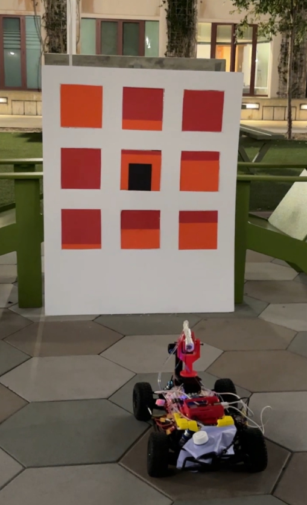
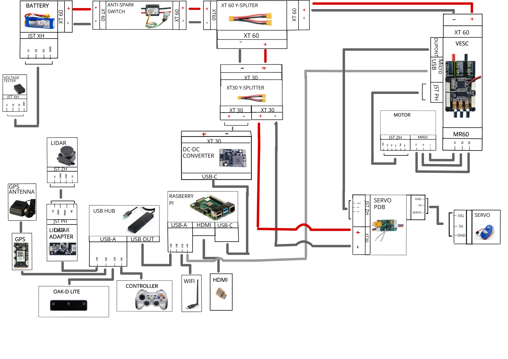

<h1 align="center">Autonomous Firefighter Robot</h1>
<h3 align="center">ROS 2–Based Perception, Decision-Making, and Fire Suppression</h3>
<h4 align="center">Final Robotics Project</h4>

 

  

 

  

## Table of Contents
<ol>
  <li><a href="#team-members">Team Members</a></li>
  <li><a href="#abstract">Abstract</a></li>
  <li><a href="#what-we-promised">What We Promised</a></li>
  <li><a href="#accomplishments">Accomplishments</a></li>
  <li><a href="#challenges">Challenges</a></li>
  <li><a href="#final-project-videos">Final Project Videos</a></li>
  <li><a href="#software">Software</a></li>
  <ul>
    <li><a href="#overall-architecture">Overall Architecture</a></li>
    <li><a href="#fire-perception">Fire Perception</a></li>
    <li><a href="#decision-making--task-planning">Decision-Making & Task Planning</a></li>
    <li><a href="#turret-aiming--water-cannon-control">Turret Aiming & Water Cannon Control</a></li>
    <li><a href="#navigation--localization-optional">Navigation & Localization (Optional)</a></li>
  </ul>
  <li><a href="#hardware">Hardware</a></li>
  <li><a href="#gantt-chart">Gantt Chart</a></li>
  <li><a href="#course-deliverables">Course Deliverables</a></li>
  <li><a href="#project-reproduction">Project Reproduction</a></li>
  <li><a href="#acknowledgements">Acknowledgements</a></li>
  <li><a href="#contacts">Contacts</a></li>
</ol>

## Team Members

- **Natan Beneviste** — Mechanical Engineering
- **Vivan Tran** — Computer Engineering
- **Tanguy His** — Robotics Engineering
- **Shanil Patel** — Aerospace Enigineering

## Abstract

The goal of this project is to develop an autonomous firefighting robot capable of detecting the locations of window fires on a mock building, estimating the severity of each fire, using a cost based algorithm to decide an optimal sequence to extinguish them efficiently, and then manipulate a relay controlled water cannon to eliminate each  window fire sequentially. 

The robot utilizes ROS2 as its foundational architecture with an OAK-D Lite camera for perception. Fire intensity is estimated from image frames using a color-based scale, more red pixels means a fire with a higher temperature and more orange pixels means a cooler fire. If a black square is present it means a person is stuck at that window location. The output of this function produces a matrix of window index, fire intensity, and person boolean (one  per window) as well as a graph for visualization. A decision-making node inputs these values into a cost based algorithm which outputs the highest value window, meaning the window that must be extinguished first. We based this algorithm on how real firefighters prioritize locations for extinguishing building fires. Finally, a turret-controlled node adjusts x-axis position and        y-position is adjusted with the drivetrain to aim a servo-actuated water cannon toward the selected window in real time.

## What We Promised

- Detect “fire” regions (red-painted metal pieces) on a cardboard building using the OAK-D Lite camera.
- Estimate a fire intensity for each window.
- Publish a structured list of targets to ROS2.
- Compute the next best target using a custom score function.
- Aim a single-servo turret and acutated the drivetrain toward the selected window and trigger suppression.

## Accomplishments
- **Fire Perception Node**
  - Implemented ROI-based window extraction.
  - Implemented red-orange-intensity estimation.
  - Can detect the presence of a person ( based on a non red/orange color that's in the window).
  - Published a fire-node list containing window IDs, temperatures, and neighbor influence values.
- **Decision-Making Node**
  - Implemented graph-based target representation.
  - Implemented next-target selection using a custom score formulation (distance + intensity + neighbor effects + presence of a person at the window).
- **Turret Control Node**
  - Implemented camera-based aiming for a 1-DOF turret.
  - Implemented drivetrain contorl for y-position movement  m
  - Implemented servo PWM output with limits.

## Challenges

- **Robust perception under lighting variation**
  - Red detection is sensitive to illumination;
- **System integration**
  - Ensuring consistent message timing and stable TF/frame assumptions across nodes.
  - Having the Brain Node sequentially run the other nodes 
- **Power and reliability**
  - Separating high-current actuator power (pump/motors) from logic power and filtering noise are critical for stable operation.

## Final Project Videos

## Software

### Overall Architecture

This project was developed in ROS2 using a modular pipeline that cleanly separates perception, decision-making, and hardware. Each stage runs as an independent ROS2 node and is communicated exclusively through topics allowing the system to be sequential.

The system will execute and repeat this sequence:

see → decide → servo → drivetrain → fire

---

## ROS 2 Node-Level Architecture

<>

---

### HSV Window Labeling

Heat is determined through the amount of red and orange pixels. More red indicates hotter temperate and more orange indicates cooler temperatures. There is a black box that will show there is a person present in the window. The mock building made of cardboard will have these variables present and the HSV Window Labeling will output those live variables to a matrix with window id, fire intensity, neighbors fire intensity, person present boolean.

---

**ROI-based window extraction**

- A calibration step defines fixed window bounding boxes (ROIs).
- Each incoming frame is cropped into per-window patches.
- Each patch is resized and normalized.

---

**Intensity estimation**

**Baseline (color-based):**

- Convert ROI to HSV or La for improved robustness to lighting changes.
- Compute a red/orange intensity score based on hue and saturation thresholds.
- Map this score to a normalized temperature or fire intensity index.

---

**Output message**

The HSV Window Labeling library publishes a structured list of detected fire windows:

- window ID – lists windows in matrix order
- temperature / intensity – determined through the amount of orange and red (outputted as a 3x3 matrix correlated with the window ID)
- Boolean Person matrix – 3x3 matrix, 1 indicated that there is a person, 0 otherwise

---

### Decision-Making & Task Planning

The decision-making library will input the matrix form the fire perception node, applying the formula (indicated below)and then outputting the window with the highest cost, needing to be extinguished first. The input matrix contains:

- `id`
- current temperature `T`
- neighbor influence `N(T)`
- optional growth model parameter `α`

At each iteration, the function selects the next window to extinguish by minimizing a custom cost:

- balance between:
  - travel cost (distance/time),
  - fire urgency (temperature),
  - cluster effects (neighbor influence),
  - predicted growth over time,
  - presence or not of a person

This is the equation:

$$
\text{cost} =
w_1 \cdot \text{travel\_cost}
+ w_2 \cdot \text{fire\_intensity}
+ w_3 \cdot \text{neighbor\_influence}
+ w_4 \cdot \text{predicted\_growth}
+ w_5 \cdot \text{safety\_penalty}
$$

---

### Fire_Dection_Node

The Fire Detection Node is responsible for converting raw camera images into a structured, decision-ready representation of the fire activity across the building. It serves as the interface between perception and decision-making, encapsulating fire detection, temperature estimation, reasoning, and debugging visualization.

This node performs three tightly integrated functions:

- Camera Input Processing
- HSV window labeling & Temperature Estimation
- Target Selection & Debug Matrix Generation

The output topics:

- Best_window → the window id of the current highest priority window
- Debug information

---

### Servo Node

Our turret has 1 servo. The camera is mounted ~5–6 cm in front of the turret base, fixed to the chassis.

---

## System Operation and Communication

The servo’s horizontal motion is controlled using the Arduino’s built-in **Servo library**, which sets the servo angle by outputting the appropriate **PWM signal**.

To activate the water cannon, the Arduino sends a **digital control signal** to a **relay**, which acts like an electronic switch—when triggered, it allows power to flow to the water cannon so it can fire.

The **Raspberry Pi** and **Arduino** communicate using **serial (UART) communication**. In this setup, the Raspberry Pi sends commands (such as 0–8 the windows label or “fire”) over the serial connection, and the Arduino interprets those commands and performs the real-time hardware actions (servo positioning and relay switching).

This division of roles keeps the Raspberry Pi protected from motor/relay electrical noise while allowing the Arduino to handle the precise timing needed for servo control and reliable firing.

**Summary:**

Subscribe to:
- `/servo_serial` (Int32)
- `/fire_command` (Bool)

Interacts with:
- Arduino via `/dev/serial/...` (USB)

Sends:
- Servo angle commands (window index)
- FIRE command

---

### VESC Node

The **VESC node** acts as the main **motor driver interface** in our ROS2 system. It serves as the software bridge between ROS and the physical drivetrain hardware controlled by the VESC.

---

## Command Input (Subscribing to Motion Topics)

The best_window topic determines the target row, which requires movement either forward, backward, or idle. The VESC node listens to those motion commands published by `/cmd_vel`.

---

## Command Translation (ROS → VESC Control)

Once a command is received, the VESC node converts the ROS message into the low-level control signals that the VESC understands. This is what allows high-level ROS navigation or control logic to directly drive the motor without needing to handle hardware-level details.

---

## Feedback Output (State and Odometry Publishing)

In addition to sending commands, the VESC node publishes feedback data back into ROS such as motor speed, voltage, current draw, and/or **odometry**. This feedback helps the system confirm the drivetrain is responding correctly and track how far the robot has moved.

---

## Why This Matters

By separating motion commands from hardware control, the VESC node makes the drivetrain easier to control and debug. Other ROS nodes can focus on decision-making while the VESC node handles reliable motor execution and feedback. Therefore handles the forward and backward movement of the car needed for aiming the row.

---

### Brain Node

The Brain Node is the central decision-making and coordination node of the system. It acts as the bridge between fire perception and the hardware, ensuring that all actions occur in the correct order and without conflict.

Rather than continuously commanding hardware, the Brain Node operates as a finite state machine (FSM) that executes a single fire-suppression cycle at a time.

Its responsibilities are to:
- Receive the best_window_id
- Coordinate turret aiming, base motion, and firing system
- Signal when the cycle is complete so perception may resume

Subscribe topic:
- `/best_target_window` (Int32)

Publishes topics:
- `/servo_serial_node` (Int32)
- `/cmd_vel` (Twist)
- `/fire_command` (Bool)
- `/cycle_complete` (Bool)

---

### Internal State Machine

The Brain Node is implemented as a finite state machine to guarantee correct sequencing and prevent unsafe behavior.

**State Definitions**

- IDLE – Waiting for a valid fire target
- AIM_TURRET – Rotate turret toward target window
- MOVE_BASE – Move robot to align with target row
- FIRE – Activate water cannon
- RESET – Stop motion and unlock next cycle

---

**Execution Logic**

1. **Target Acquisition (IDLE)**  
   The Brain Node waits for `/best_target_window`.  
   Once received, it:
   - Validates the window index
   - Stores temperature and metadata
   - Locks the system to prevent new targets

2. **Turret Aiming (AIM_TURRET)**  
   - Converts the window index into a target column  
   - Publishes `/servo_serial_node` with the desired turret position  
   - Waits a fixed settling time to allow servo stabilization  
   - Prevents firing while the turret is still moving

3. **Base Alignment (MOVE_BASE)**  
   - Converts the window index into a target row  
   - Publishes `/cmd_vel` to move the robot forward or backward  
   - Uses time-based or distance-based motion control  
   - Stops motion once alignment is achieved

4. **Fire Command (FIRE)**  
   - Publishes `/fire_command = true`  
   - Holds the command long enough to ensure actuation  
   - Immediately resets `/fire_command` to false  

5. **Reset & Unlock (RESET)**  
   - Publishes `/cycle_complete = true`  
   - Clears internal state variables  
   - Returns to IDLE  

At this point, the perception node is allowed to process the next frame.

## Hardware

**Compute**
- Raspberry Pi 5
- Arduino Leondardo Micro 
- MicroSD storage

**Sensors**
- OAK-D Lite RGB-D camera
**Actuation**
- 1x servo motor
- water pump / solenoid valve
- chassis drivetrain (VESC + motor)

**Power**
- 4S LiPo battery
- Dedicated DC-DC converters (logic 5V separated from high-current actuators)
- anti-spark voltage monitoring
  

  

**Mechanical**
- Cardboard mock building with painted metal “windows”
- 3D-printed base plate
  

  

- 3D-printed mounts for camera and turret

  

  
  

## Water Cannon Design Choice

We chose to use a water cannon from a electronic squirt gun because it was a budget-friendly option that already included everything we needed to perform the task, such as:
- a strong pump  
- a built-in water tank  
- a compact design for easy mobility  

To protect the electronics, we kept the water tank in the trunk of the car so any leaks or spills wouldn’t risk shorting components.

## Mounting and Rotation Mechanism

We used a simple 3D-printed design to hold the water cannon securely, then the servo was mounted in a grove on the underside of the water cannon bracket to allow for it    x-position movement.

The baseplate layout was planned to leave:
- enough space on top for the servo mount  
- room for the targeting mechanism  

## Steering Lock for Accuracy

To prevent the cannon from drifting off-target, we detached the car’s steering servo and locked it in place. This ensured there were no unintended direction changes while firing.

## Gantt Chart

 

  

## Course Deliverables

* Functionnal car: https://youtu.be/cYO1r23sewk
* Deep learning laps: https://youtu.be/hFGpkKaZCqE
* GPS laps : https://youtu.be/9ZRp8OY7T6o
* Opencv lane following: https://youtu.be/XaypVPjqVfU

## Project Reproduction
To reproduce this project:

<ol>
  <li>Install ROS2 and create a workspace.</li>
  <li>Install DepthAI ROS driver (OAK-D Lite support).</li>
  <li>Clone this repository:
<pre>
cd ~/ros2_ws/src
git clone --recurse-submodules https://github.com/YOUR_ORG/YOUR_REPO.git
</pre>
  </li>
  <li>Build:
<pre>
cd ~/ros2_ws
colcon build
source install/setup.bash
</pre>
  </li>
  <li>Launch perception:
<pre>
ros2 launch firefighter_perception perception.launch.py
</pre>
  </li>
  <li>Launch decision:
<pre>
ros2 launch firefighter_decision decision.launch.py
</pre>
  </li>
  <li>Launch turret control:
<pre>
ros2 launch firefighter_turret turret.launch.py
</pre>
  </li>
</ol>

## Acknowledgements

Special thanks to Professor Jack Silberman and TA's Winston Chou and Aryan Palaskar for delivering the course !

**References**
- ROS2: https://docs.ros.org/
- DepthAI ROS Driver: https://github.com/luxonis/depthai-ros

